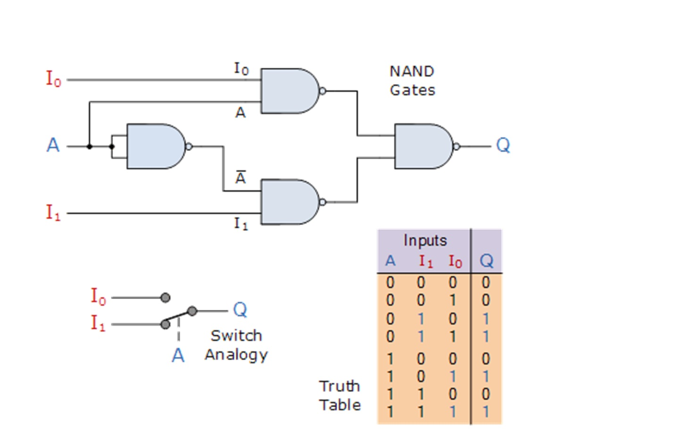
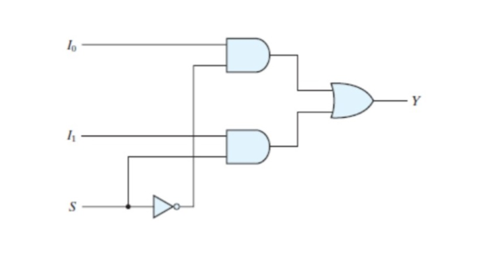
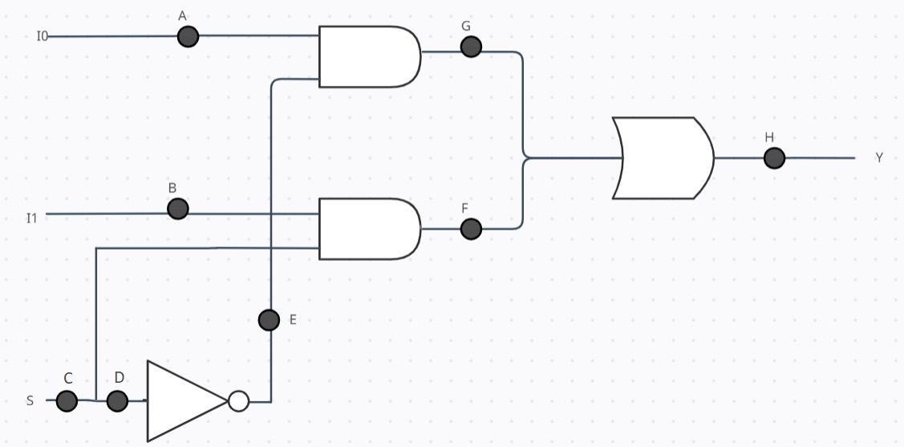

### Theory

### Multiplexer

Multiplexing is the generic term used to describe the operation of sending one or more analogue or digital signals over a common transmission line at different times or speeds and as such, the device we use to do just that is called a Multiplexer.

The multiplexer, shortened to "MUX", is a combinational logic circuit designed to switch one of several input lines through to a single common output line by the application of a control signal. Multiplexers operate like very fast acting multiple position rotary switches connecting or controlling multiple input lines called "channels" one at a time to the output.

Multiplexers, or MUX's, can be either digital circuits made from high speed logic gates used to switch digital or binary data or they can be analogue types using transistors, MOSFET’s or relays to switch one of the voltage or current inputs through to a single output.

The most basic type of multiplexer device is that of a one-way rotary switch.

Generally, the selection of each input line in a multiplexer is controlled by an additional set of inputs called control lines and according to the binary condition of these control inputs, either "HIGH" or "LOW" the appropriate data input is connected directly to the output. Normally, a multiplexer has an even number of 2n data input lines and a number of "control" inputs that correspond with the number of data inputs.

There are many types of multiplexers. Here we will see the working of a 2x1 multiplexer and how it is different when any of the input/output line is stuck at fault 1.

### 2x1 Multiplexer

The input A of this simple 2-1 line multiplexer circuit constructed from standard NAND gates acts to control which input (I0 or I1) gets passed to the output at Q.

From the truth table above, we can see that when the data select input, A is LOW at logic 0, input I1 passes its data through the NAND gate multiplexer circuit to the output, while input I0 is blocked. When the data select A is HIGH at logic 1, the reverse happens and now input I0 passes data to the output Q while input I1 is blocked.

So by the application of either a logic "0" or a logic "1" at A we can select the appropriate input, I0 or I1 with the circuit acting a bit like a single pole double throw (SPDT) switch.

As we only have one control line, (A) then we can only switch 21 inputs and in this simple example, the 2-input multiplexer connects one of two 1-bit sources to a common output, producing a 2-to-1-line multiplexer. We can confirm this in the following Boolean expression.

 

2x1 MUX Design
 

Q = A’.I0’.I1 + A’.I0.I1 + A.I0.I’1 + A.I0.I1

and for our 2-input multiplexer circuit above, this can be simplified too:

Q = A’.I1 + A.I0

We can increase the number of data inputs to be selected further simply by following the same procedure and larger multiplexer circuits can be implemented using smaller 2-to-1 multiplexers as their basic building blocks. So for a 4-input multiplexer we would therefore require two data select lines as 4-inputs represents 22 data control lines give a circuit with four inputs, I0, I1, I2, I3 and two data select lines A and B as shown.

2x1 Multiplexer has two data inputs I0 and I1. Since there are 2 input lines, it has only one selection line S. 2x1 Multiplexer gives only one output Y.

The truth table for 2x1 multiplexer is as follows-

<table style="text-align:center;">
        <tr>
          <th>Select Line (S)</th>
          <th>Output (Y)</th>
        </tr>
        <tr>
          <td>0</td>
          <td>I0</td>
        </tr>
        <tr>
          <td>1</td>
          <td>I1</td>
        </tr>
      </table>

2x1 MUX Truth Table
 
It contains 2 AND gates, a NOT gate and a OR gate.  

 

2x1 MUX Logic Circuit
 

The final output expression for 2x1 multiplexer is Y= I0S’+I1S.

### Faults

Faults are the physical defects within a circuit or a system. It may or may not cause a system failure. In general the effect of the fault is represented by a means of model, which represents the change the fault produces in circuit signals. One such example of fault model is stuck-at-fault. It is the most common model used for the logical faults. A stuck-at fault (SAF) is a logic-level fault that mimics a manufacturing defect on a digital device, circuits, etc. An SAF is two types: stuck-at-0 (SA0) and stuck-at-1 (SA1) fault. Individual input bit or signal on a wire of a logic gate or circuit is assumed to be stuck at Logical '1’, or '0' if the input bit (signal) is converted to logic-1 or logic-0 irrespective of its previous or assigned value.

This experiment focuses on SA1 faults of 2x1 Multiplexer. 

 

SA1 Fault locations in 2x1 MUX
 

We can have SA1 faults at 8 possible locations. When the expected output is different from the final output the fault gets detected. When the expected output is not different from the final output the fault does not get detected, despite having a fault.The expected output is the output of the circuit when there is no fault and the final output is the output of the circuit with SA1 fault present at some location(s).

For example,
When the expected output is 0 and final output is 1 - the expected fault locations are A, S, B, C, E, F, G and H.
Similarly, When the expected output is 1 and final output is 0 - the expected fault locations are A, C and D.  
